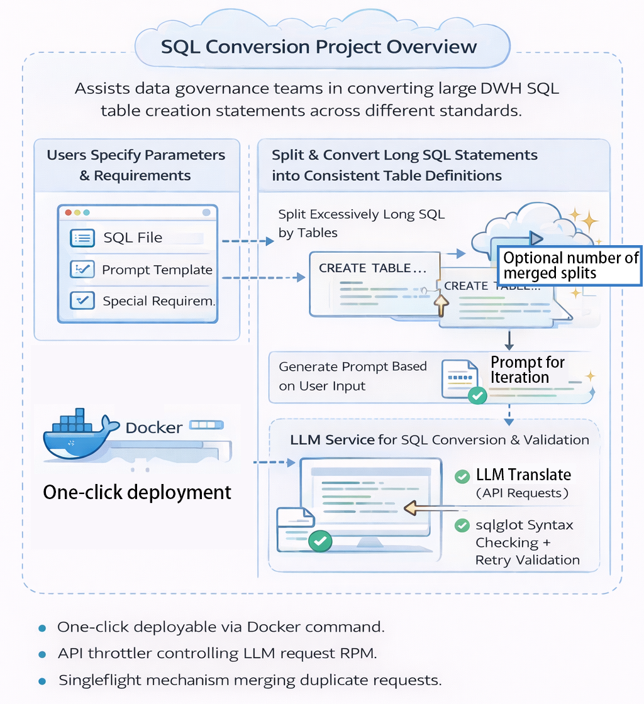

# SQL Transfer Agent (LLM-Driven SQL Table Migration and Data Warehouse Standardization Tool)

[](https://www.python.org/)
[](https://github.com/langchain-ai/langgraph)
[](https://dashscope.aliyuncs.com/)
[](https://github.com/tobymao/sqlglot)

This project is a migration and standardization tool designed for **large SQL table creation statements**, primarily for Data Warehouses (DWH), across different database standards. It splits long SQL statements based on tables and provides the ability to generate prompts for conversion. The tool uses **LangGraph** orchestration, **LLMs (default: Qwen / DashScope)** for transformation, and **sqlglot** for syntax validation and auto-retry.



---

## Key Features

- **Batch SQL Migration**: Upload an SQL file that may contain multiple tables and convert them into the correct format for the destination database.
- **Automatic Prompt Normalization**: LLM generates a "universal prompt" template for each table transformation to ensure consistency.
- **Concurrent Chunk Processing**: Uses `asyncio` for concurrency, processing chunks concurrently and validating them using LLMs.
- **Syntax Validation & Auto-Retry**: Utilizes `sqlglot.parse()` for SQL syntax validation. If parsing fails, an error will be sent back to LLM to trigger a retry.
- **Checkpoint & Resume**: Implements `langgraph.checkpoint.sqlite.aio.AsyncSqliteSaver` for resuming long tasks from checkpoints.
- **Two Operation Modes**:
  - **Main Graph**: End-to-end batch process (Generate Prompt → Split → Run Chunk Graph in parallel → Collect Outputs).
  - **Web App**: Lightweight frontend (HTML/JS) for chunking and orchestration; backend only provides "single chunk" conversion API.

---

## Deployment

### Deploy via Docker (Recommended)

To quickly deploy the project using Docker, use the following command:

```bash
docker run -d -p 8000:8000 -e API_KEY=YOUR_API_KEY -e LLM_TYPE=YOUR_LLM_TYPE -e LLM_RPM=5 --name llm-sql-translator fengleo/llm-sql-translator:latest
```

This command runs the project in a Docker container with the specified API key, LLM type, and rate limit (RPM). 

### Prerequisites

If you prefer manual deployment, here are the requirements:

- Python 3.12+ (recommended version).
- A valid API key for the LLM model

### Install Dependencies

```bash
pip install -r requirements.txt
export API_KEY="YOUR_KEY"
```

### Start the Web Service

```bash
uvicorn webapp.server:app --host 0.0.0.0 --port 8000 --reload
```

Access:

- `http://localhost:8000/`

---

## Implementation Details

### 1) Double Layer Cache and Recovery: LangGraph Checkpoints + Browser Session

- **LangGraph Checkpoint Caching**: The backend uses LangGraph’s SQLite checkpointer (`resources/checkpoints.db`) to persist task execution progress and intermediate states for checkpoint recovery and result reuse.
- **Browser Session Caching**: The frontend stores session snapshots (parameters, chunked data, generated prompts, chunk results/errors) in the browser’s storage.
- **Recovery after Refresh**: After a page refresh, the session is restored from the browser’s storage, allowing continued interaction.
- **Avoiding Redundant Requests**: If a task is suspended due to page refresh, the user can re-trigger it, and the backend will use checkpoint data to resume, saving resources by avoiding redundant requests.

### 2) Prompt Normalization (Global Consistency)

- The user provides a **user prompt**, **parameters**, and an optional **destination SQL example template**.
- The backend normalizes this into a single **general prompt**, which will be used for all chunks unless specifically overridden.
- All chunks default to using this `general_prompt` unless explicitly overridden for specific chunks.

### 3) Chunk Conversion, Validation & Auto-Retry

- The backend performs conversion on each chunk via the `/api/convert_chunk` endpoint.
- It validates SQL syntax using `sqlglot.parse()`.
- If validation fails, the error is injected into the prompt context to trigger a retry (subject to `MAX_TRY` retries).

### 4) SQL Splitting Rules (Client-Side)

- Case-insensitive matching of `CREATE TABLE` statements.
- For each `CREATE TABLE`, it looks for the closest `;` on the left and uses that as the split point.
- If no `CREATE TABLE` is found, the entire statement is considered a single chunk.

### 5) Key Technical Features

- **Rate Limiter**: The system includes a **rate limiter** to control the number of API calls made to the LLM, preventing exceeding the API's rate limit and ensuring that API calls are made in a controlled manner. This is implemented using a **QPM (Queries per Minute)** throttle, and it can optionally operate in **FIFO (First In, First Out)** mode to process requests in the order they arrive.
- **SingleFlight**: To prevent redundant requests, the system uses a **singleflight** mechanism, which ensures that only one request is made for the same task at a time, even if multiple users or processes request it simultaneously. This optimizes token usage and prevents wasteful processing.

---

## Technology Stack

- **Frontend**: Native HTML / CSS / JavaScript (for SQL splitting, session restoration, concurrency handling, and visual feedback).
- **Backend**: FastAPI + Uvicorn.
- **Orchestration & Recovery**: LangGraph + SQLite Checkpointer.
- **LLM Integration**: Qwen / DashScope (OpenAI-compatible).
- **SQL Validation**: sqlglot.
